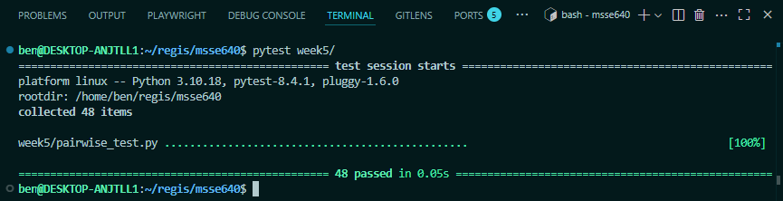

# Pairwise Testing

## Section 1: Introduction

Pairwise testing (also known as all-pairs testing) is a software test design technique that ensures every possible pair of input parameter values is covered by at least one test case. Instead of exhaustively testing all combinations of inputs, pairwise testing focuses on combinations of two parameters at a time. This approach leverages the observation that many defects are caused by the interaction of two factors, so covering all pairs yields high defect detection with far fewer tests. In practice, pairwise test generation algorithms systematically create a minimal set of test cases such that for each pair of parameters, every possible pair of values appears in some test. By doing so, the number of test cases grows much slower than an exhaustive test matrix (cutting an exponential number of cases down to a near-linear count) while still maintaining broad coverage of potential interactions.

## Section 2: Code Example

Imagine we are creating the self-checkout machines in a grocery store. We want to make sure customers cannot purchase items they are not allowed to, but we would like to internationalize the machines for both the US and the EU. It would be near impossible to test every item that could be on sale in a grocery store, in addition to the added difficulty of testing for every age combination and accounting for differences in regulation between countries. 

Pairwise testing is a good option for us.

Refer to the [code that determines whether one can purchase an item here](./pairwise.py) and the [tests for that code here](./pairwise_test.py).

Even that small piece of code in the test resulted in 48 combinations. Without using pairwise testing, there could be many magnitudes more. 

## Section 3: When Should This Type of Testing Be Used

Pairwise testing is especially effective in scenarios where exhaustive testing is impractical but broad coverage of input combinations is still needed. You should consider using pairwise testing in situations such as:

- Many parameters or configurations
- Exhaustive testing infeasible
- Automated test generation
- For configuration matrices (platforms/browsers)

Pairwise testing is applicable to a wide range of domains whenever you have multiple input factors to combine, and it is most beneficial when two-factor interactions are likely to uncover the majority of issues.

## Section 4: Limitations

Like any testing technique, pairwise testing has its limitations and trade-offs to be aware of:

- Only covers n-way interactions
- Potential for invalid or irrelevant combos
- Doesn’t catch all issue types
- Dependent on good parameter selection

## Section 5: References

I used a ChatGPT prompt to help me write this analysis of pairwise testing. The prompt I used was, "Please write a test case analysis of pairwise testing, breaking it down into 4 sections: an introduction, a coding example, when it should be used, and its limitations." It hallucinated the first prompt, stating that there was a pairwise testing module in PyTest called `pairwise`. I needed to rewrite the entire section two because of being incorrect. 