# Project 3: Performance Testing

## Part 1: Research

### Introduction

Performance testing ensures that an application can handle expected and unexpected workloads while maintaining acceptable functioning levels. Three types of performance tests are discussed (load, endurance, and stress/spike) and how each evaluates system behavior under different traffic conditions. 

### Types

#### Load Testing

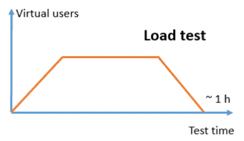

Load testing is a type of performance test that examines how a system behaves under expected normal and peak load conditions. The goal is to verify that the system can handle the anticipated number of concurrent users or requests while meeting performance criteria (response time, throughput, error rate, etc.). In a load test, the number of virtual users (threads) is gradually increased to the expected peak load and then held at that level for a certain duration. For example, a load test might ramp up to 1,000 users over several minutes and sustain that load to observe system behavior. By analyzing metrics during the steady load, testers can ensure the application performs well under normal peak usage.

#### Endurance (Soak) Testing

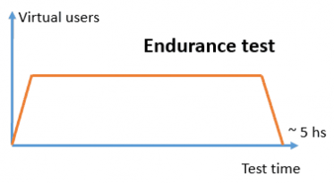

Endurance testing (also known as soak testing) evaluates system performance and stability over an extended period under a moderate or expected load. The purpose is to identify issues that only emerge during prolonged operation, such as memory leaks, resource exhaustion, or performance degradation over time. In an endurance test, the load (number of threads/users) is ramped up to a certain level and then held for many hours (or even days). This helps reveal problems like gradual memory buildup or slowed response times that wouldn’t be detected in shorter tests. An endurance test ensures the system can sustain continuous load without deteriorating in reliability or responsiveness. 

#### Stress (Spike) Testing

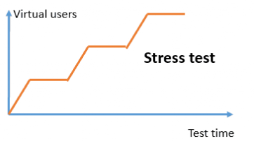

Stress testing pushes the system beyond its normal operational capacity to find the breaking point or to observe how it fails and recovers. In a stress test, testers gradually increase the load (threads/users) until the system either crashes or performance becomes unacceptable, determining the upper limits of capacity. A spike test is a special kind of stress test where the load is increased very abruptly and significantly (a sudden surge of users) and then potentially dropped just as quickly. The graph above illustrates a spike test: the number of threads jumps sharply in a short time, far above normal levels, then may drop back down. Spike tests evaluate whether the system can handle flash traffic bursts (for example, a sudden rush of users during a one-time event) and how quickly it recovers afterward. Both stress and spike testing help ensure the system fails gracefully under extreme conditions and can recover once the load returns to normal. These tests might reveal concurrency issues, bottlenecks, or stability problems not seen under lower loads.

### Locust (and its JMeter Equivalents)

In this section, JMeter components and functionalities are mapped to their Locust equivalents.

#### Threads and Thead Groups vs. Locus Users

A Thread Group in JMeter defines a set of virtual users (threads) and the test schedule (how many threads to start, ramp-up time, and loop count or duration). For example, a Thread Group might be configured to ramp up 100 threads over 60 seconds and keep them running for a test duration. 

In Locust, there isn’t an explicit "Thread Group" component in the same way; instead, you write a Python class representing a user behavior, and Locust spawns multiple instances of that class as concurrent users. The number of users (threads) and the hatch rate (ramp-up) are provided when you launch the Locust test (via the web UI or command-line flags), rather than being fixed in the test script. For instance, you might start Locust with -u 100 -r 5, meaning 100 users with a ramp-up of 5 users per second, which corresponds to JMeter’s thread group settings. During the test run, Locust even allows adjusting the user count on the fly through its web interface, similar to changing the thread count dynamically, which is something not readily done in JMeter’s GUI once a test starts.

#### HTTP Request Samplers vs. Locust Tasks

In JMeter, an HTTP Request Sampler is used to define an HTTP call (GET, POST, etc.) that each thread will execute. You can have multiple samplers (e.g., one for hitting a homepage, another for an API call) organized under controllers within a thread group. In Locust, HTTP requests are made in Python code as tasks. You define tasks using methods annotated with `@task` in your `HttpUser` class (or by setting a tasks list). Each Locust user will execute these tasks, making actual HTTP calls via Locust’s built-in HTTP client.

#### Listeners vs. Locust Results and Reporting

JMeter Listeners are components that collect and display test results. They can show response details, aggregate metrics, charts, and can also write results to files for analysis. In Locust, you don’t add listeners in the test script; instead, Locust provides monitoring and reporting out-of-the-box. When you run a Locust test with the web interface, you get a live web UI dashboard that shows real-time statistics, charts, and failure logs, similar to various JMeter listeners.

## Part II: Demonstration

A Python-written Flask web application is found in [./server.py](./server.py). It exposes just two endpoints: 1) a home page and 2) a page that accepts a parameter `n` and then does an `O(n^3)` operation before responding.  

To run the application locally, once can run (from the root)

```Python
. venv/bin/activate

gunicorn -w 1 -b 0.0.0.0:5000 week6.project3.server:application
```

To deploy it to AWS Elastic Beanstalk, a utility to zip the project for upload can be found in [scripts/zip_project3](../../scripts/zip_project3). 

A Locust test can be found in the [locustfile.py](./locustfile.py). It hits both endpoints to varying degrees to mimic real user behavior. 

### Stress Test

After deploying the web application to AWS, I proceeded to test the application on a `t2.micro` EC2 instance. I accomplished a stress test by incrementing the number of users by 10 every minute (starting at 10) with a ramp-up of 5 users per second. 

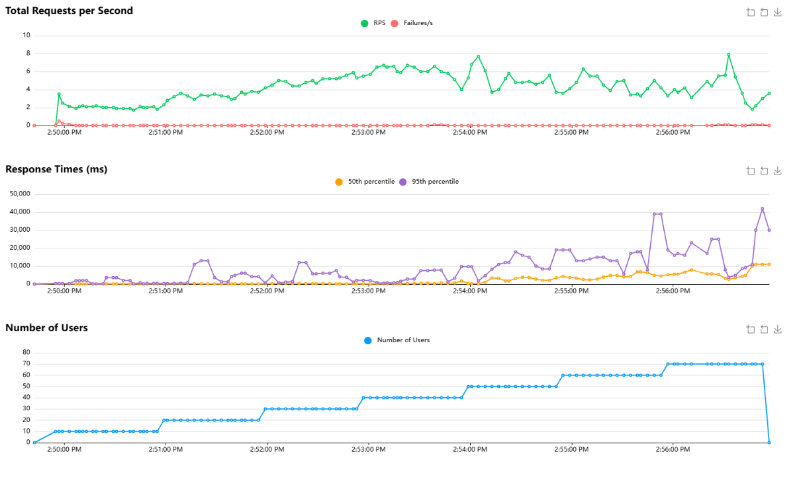

The service began to degrade around 50 users. The total requests per second became erratic and the 50th percentile response time surpassed 1-2 seconds. CPU utilization became quite high (35%). 

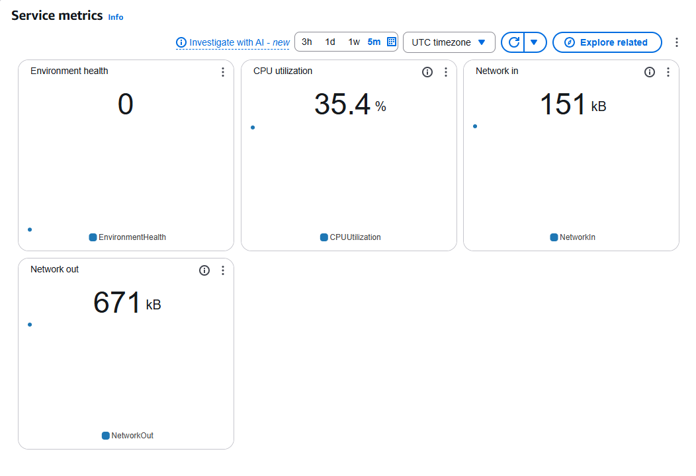

### Load Test

To do load tests, I tested the application with 10 users and 100 users.

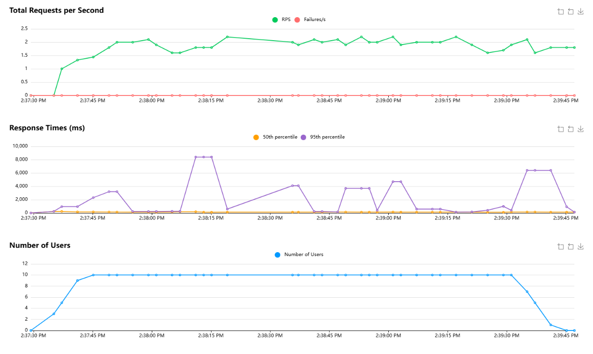

While the 95th percentile of response time spiked to 8 seconds (likely due to hitting the expensive endpoint with a higher number), the 50th percentile stayed in the milliseconds and the number of requests per second stayed stable. CPU utilization is low.

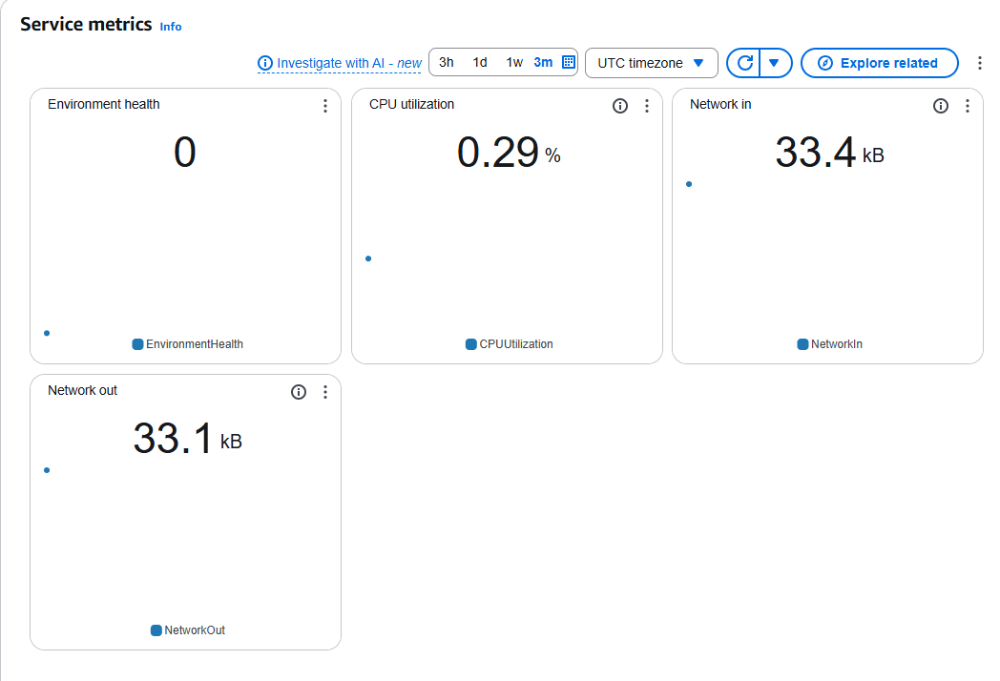

However, increasing the load to 100 users, the application became unusable. 

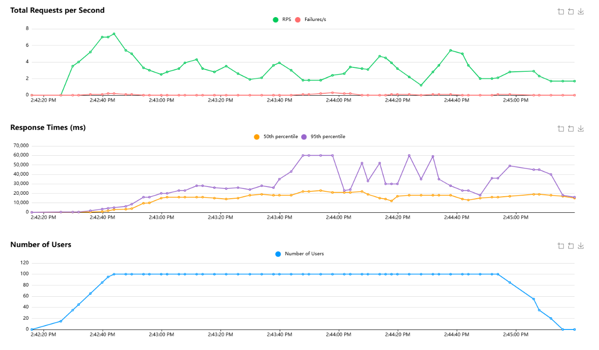

Response times exceeded 20 seconds and requests per second dropped to half that of the application under a managable load of 30-40 users. Again, CPU utilization increased.

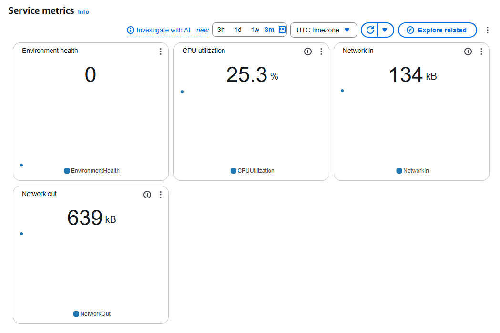

### Endurance Test

To mimic an endurance test, I put the application under the load of 30 users for 10 minutes. While this is not long enough to be a real endurance test, it keeps me from having to pay for AWS resources.

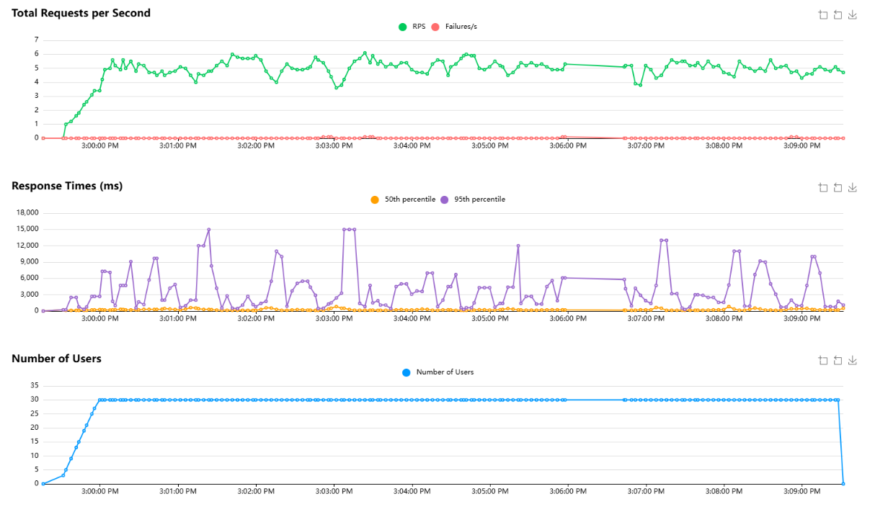

The application consistently stayed around 5-6 requests per second and had well under a 1-second response time (even for expensive operations). 

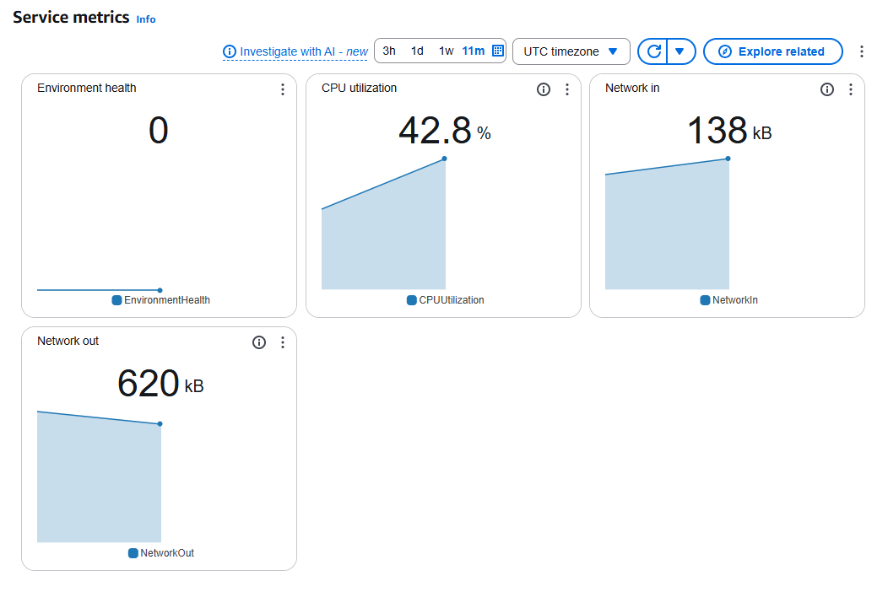

### Conclusion

I had never used AWS Elastic Beanstalk and was surprised at how easy it was to deploy an application. Without reading any documentation, I deployed a webserver in 5-10 minutes. 

The next steps for this testing would be to choose a larger EC2 instance. `t2.micro` is incredibly small, with a single core and 1 GiB of RAM. Using a `t2.large` or `t2.xlarge` could vertically scale the application to much higher loads. This should be done before doing any horizontal scaling tests so that one understands what the optimal size per EC2 instance for horizontal scaling is. I think that would be a good addition to this assignment, to get students familiar with those terms and scaling in general. 

## Extra Credit

What Linux commands can be used to test and evaluate performance on a Virtual Machine or server?

- `top` continuously displays active processes and their CPU utilization and memory usage
- `iostat` monitors disk I/O and CPU usage
- `free -m` shows memory usage (free, used, swap)